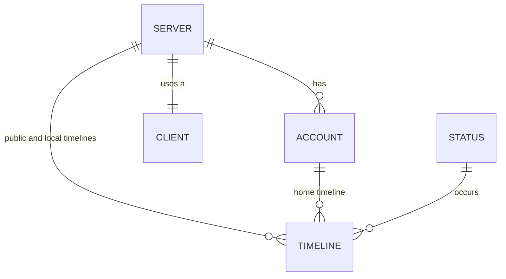

```mermaid
erDiagram
          SERVER ||--o{ ACCOUNT : has
          SERVER ||--|| CLIENT : "uses a"
          SERVER ||--o{ TIMELINE : "public and local timelines"
          ACCOUNT ||--o{ TIMELINE : "home timeline"
          STATUS ||--o{ TIMELINE : occurs
```
